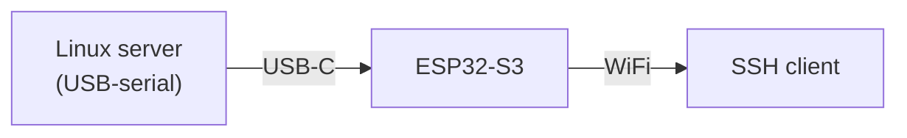
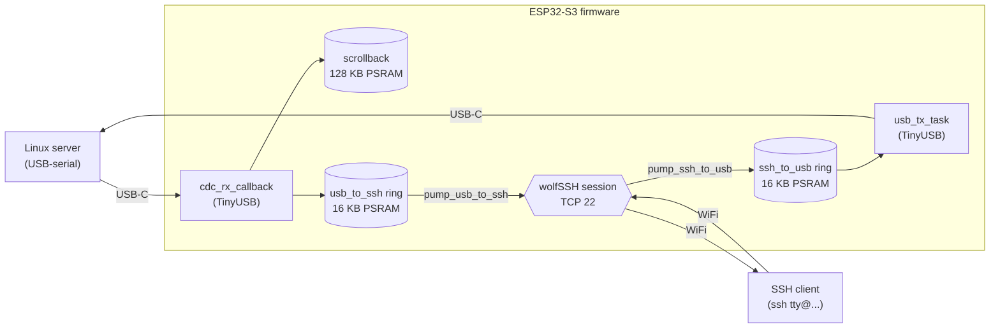

# esp-tty -- Nano Console Server

Wireless out-of-band serial console -- designed for a Linux server you
don't want to lose access to.

When the server's primary network goes down -- bad netplan, locked-out
firewall rule, NIC carrier loss, mis-pulled cable, switch failure on
the management VLAN -- you reach it via this device. Plug the
ESP32-S3 DevKit into any free USB port on the server. The server
sees a virtual serial port (`/dev/ttyACM0` from the ESP32-S3's
TinyUSB CDC ACM endpoint) and runs `agetty` on it just like a
hardware serial console. SSH into the ESP32-S3 over WiFi: you're
at the server's login prompt over a network path that has nothing
to do with the server's main NIC.

Scope: the bridge needs Linux to be up -- the USB CDC interface
depends on the server's USB stack and `agetty` running. It's for
"Linux is healthy, network is broken," not for pre-boot, kernel
panic, or a hung USB subsystem. The ESP32-S3 is the USB device;
the server is the USB host; there is no serial-header / TTL-adapter
path.



The other end has to be a USB *host* running something with a TTY
on the resulting CDC node -- i.e. a general-purpose OS that runs an
agetty / serial-console on /dev/ttyACM*. In practice that means a
Linux server (the design intent), a Linux single-board computer
(Raspberry Pi, etc.) running `serial-getty@ttyACM0`, or any other
Linux/BSD/macOS host you want a remote console on. Network switches,
microcontroller dev boards, and other USB-device peripherals don't
fit -- they don't host USB, and they don't run a getty on a CDC node
even if they did.

A single SSH session is active at a time; opening a second one
preempts the first within ~200 ms. Public-key authentication only.
The username `tty` selects an interactive console session; the
username `ota` accepts a signed-and-encrypted firmware update over
the same SSH channel. Any other username is rejected before any key
material is inspected.

## Features

- **Wireless serial bridge** -- TinyUSB CDC ACM <-> wolfSSH stream over
  WiFi (TCP 22 by default), two 16 KB PSRAM ring buffers in between.
- **128 KB scrollback** -- captures the target's serial output even when
  no SSH client is connected; the last 1000 lines are replayed on every
  new SSH session.
- **Public-key auth** -- up to 8 ED25519 keys for `tty@` sessions
  (`AUTHORIZED_PUBKEYS` array), one separate key for `ota@`.
- **Hardware-accelerated crypto** -- ESP32-S3 SHA and AES peripherals via
  the wolfSSL Espressif port; mbedTLS for OTA also HW-accelerated.
  AES-256-GCM is the only cipher offered.
- **ED25519 host key**, generated on first boot, stored in
  AES-XTS-256-encrypted NVS. Fingerprint printed at every boot.
- **Signed + encrypted OTA** -- ECDSA-P256 signature, AES-256-GCM payload,
  A/B partition scheme, automatic rollback if the new image fails its
  30-second self-test.
- **WPA2/WPA3-Personal** out of the box; **WPA2/WPA3-Enterprise EAP-TLS**
  opt-in via a `#define` (see [`main/certs/README.md`](main/certs/README.md)).
- **Off-grid networking defaults** -- unlimited WiFi reconnect and a DHCP
  watchdog that re-kicks the DHCP client if no lease arrives. Survives an
  AP or DHCP server outage without intervention.
- **Single config file** -- `main/config.h` (gitignored) holds every
  per-deployment knob: credentials, keys, USB descriptors, MAC override,
  hostname, retry policy, buffer sizes.
- **240 MHz CPU, `-O2` build** -- production-tuned performance defaults.
- **155 native unit tests** -- `pio test -e native` runs the full suite
  on the host without any ESP32 hardware or emulator.

## Hardware

Target: **Espressif ESP32-S3-DevKitC-1 N16R8** -- 16 MB QIO flash, 8 MB
OPI PSRAM. The PSRAM holds the ring buffers and scrollback; the flash
holds the A/B OTA partitions.

Other ESP32-S3 modules work with adjustments to `partitions.csv` (assumes
16 MB flash) and `boards/esp32-s3-devkitc-1-n16r8.json` (PSRAM type).
Boards without PSRAM need the ring sizes and scrollback capacity reduced
to fit internal SRAM.

## Quick start

```
git clone <repo-url> && cd esp-tty
python3 -m venv .venv && .venv/bin/pip install -r requirements.txt

cp main/config.h.example main/config.h
$EDITOR main/config.h     # WIFI_SSID, WIFI_PASS, AUTHORIZED_PUBKEYS,
                          # OTA_AUTHORIZED_PUBKEY at minimum

bash scripts/gen_ota_key.sh   # writes ota_keys/{sign.key,sign.pub,aes.key}

make            # build + flash (auto-detects the CH340 port)
```

Find the device IP and host-key fingerprint in the UART boot log
(`make monitor` or `pio device monitor`):

```
I (1099) wifi: DHCP hostname: esp-tty
I (1203) wifi: WiFi MAC: 1c:db:d4:74:a1:fc
I (5026) wifi: IP address : 192.168.1.42
I (5037) host_key: Host key SHA-256 fingerprint: 88:e0:a6:58:...
I (5079) ssh_server: Listening on TCP port 22
```

Connect:

```
ssh tty@192.168.1.42
```

Verify the fingerprint matches what was printed on first boot. The
username **must** be `tty` for a console session -- any other name is
rejected.

### Server-side setup

On the Linux server the ESP32-S3 plugs into via USB, enable the stock
systemd serial-getty on the CDC device:

```
systemctl enable --now serial-getty@ttyACM0.service
```

No drop-ins, no `TERM=` override, no special agetty flags needed.
SSHing into the device now lands you at the server's login prompt
over the bridge, with full TTY behaviour (echo, line editing,
job control, scrollback). This is the primary use case: a second
network path to your server's console, independent of its main NIC.

## Configuration

Every per-deployment knob lives in `main/config.h` (copied from
`main/config.h.example`, gitignored). The example file documents each
option with usage notes; the highlights:

| Section | Keys | Purpose |
|---|---|---|
| WiFi | `WIFI_SSID`, `WIFI_PASS`, optional `WIFI_USE_ENTERPRISE` | network credentials |
| SSH | `SSH_PORT`, `AUTHORIZED_PUBKEYS`, `OTA_AUTHORIZED_PUBKEY` | port + auth |
| USB | `USB_VID`, `USB_PID`, `USB_MANUFACTURER_STRING`, `USB_PRODUCT_STRING`, `USB_SERIAL_STRING`, `USB_CDC_STRING`, `USB_DEVICE_VERSION` | descriptors shown by `lsusb` |
| Network identity | `DEVICE_HOSTNAME`, optional `WIFI_MAC_BYTES` | DHCP hostname, MAC override |
| IPv4 addressing | `USE_STATIC_IPV4` (define to enable), `STATIC_IPV4_ADDRESS`, `STATIC_IPV4_NETMASK`, `STATIC_IPV4_GATEWAY`, optional `STATIC_IPV4_DNS_PRIMARY` / `STATIC_IPV4_DNS_SECONDARY` | default DHCPv4; define `USE_STATIC_IPV4` for a fixed address |
| IPv6 addressing | `IPV6_MODE` -- one of `IPV6_MODE_DISABLED`, `IPV6_MODE_SLAAC` (default), `IPV6_MODE_SLAAC_STATELESS_DHCPV6`, `IPV6_MODE_STATEFUL_DHCPV6`, `IPV6_MODE_STATIC`; static mode also needs `STATIC_IPV6_ADDRESS`, `STATIC_IPV6_PREFIX_LEN`, `STATIC_IPV6_GATEWAY`, optional DNS | IPv6 addressing mode |
| Tuning | `WIFI_MAX_RETRY` (0 = infinite), `DHCP_RETRY_TIMEOUT_SEC`, `TCP_KEEPALIVE_*`, `SSH_HANDSHAKE_TIMEOUT_SEC`, `OTA_ROLLBACK_DELAY_MS` | timeouts and retry policy |
| Buffers | `RING_BUFFER_BYTES`, `SCROLLBACK_BUFFER_BYTES`, `SCROLLBACK_REPLAY_LINES`, `MAX_TTY_KEYS` | memory sizing |

All knobs guard with `#ifndef`, so omitting any of them keeps a sensible
production default.

## OTA updates

Sign and encrypt a built firmware image, then stream it over SSH:

```
python3 scripts/sign_firmware.py .pio/build/esp32s3/firmware.bin
ssh -i ~/.ssh/ota_key ota@<device-ip> < .pio/build/esp32s3/firmware.bin.ota
```

The device:
1. Reads the streamed image into PSRAM.
2. Verifies the ECDSA-P256 signature against the public key embedded in
   firmware.
3. Decrypts the AES-256-GCM payload and verifies the authentication tag.
4. Writes the inactive OTA partition.
5. Sets the new partition as the next boot target and reboots.
6. The new firmware self-marks valid after 30 s; if it crashes or
   wedges before then, the bootloader rolls back automatically.

A failed signature or tag check aborts the upload; the boot partition
is not modified.

## Security model

Authentication is public-key only. The authorized keys are compiled into
the firmware from `config.h`; they live in flash, not NVS, and cannot be
changed without a re-flash.

The threat model is a network attacker. A physical attacker who can
dump the SPI flash can extract the NVS key from the `nvs_keys` partition
and decrypt the on-device NVS (which holds the ED25519 host key). They
cannot extract the authorized public keys (those are in firmware flash,
which is unencrypted), and they cannot sign new OTA images without the
ECDSA-P256 private key, which never touches the device.

Cipher hardening (compile-time):
- AES-CBC, AES-192, SHA-1 MAC, DH key exchange are all disabled in
  `components/wolfssl/include/user_settings.h`.
- The runtime cipher list is additionally pinned to
  `aes256-gcm@openssh.com` only via `wolfSSH_CTX_SetAlgoListCipher`.

No eFuses are burned. SPI flash encryption (which would close the
physical-extraction gap) is permanent and would block reflashing; it's
intentionally out of scope.

## Architecture



The single FreeRTOS `ssh_server_task` runs the accept loop. On each
connection it authenticates the user and, for `tty@`, spawns two pump
tasks that move bytes between the wolfSSH stream and the rings. The
TinyUSB callback (RX) and `usb_tx_task` (TX) are persistent and reuse
the same rings across sessions.

## Project layout

| Path | What's there |
|---|---|
| [`main/`](main/README.md) | Firmware entry point and ESP-IDF-dependent code |
| [`main/certs/`](main/certs/README.md) | EAP-TLS client certificates (gitignored except `.example`) |
| [`lib/`](lib/README.md) | Platform-agnostic libraries -- also compile on native host for tests |
| [`components/`](components/README.md) | Local ESP-IDF components (currently just the wolfSSL bridge) |
| [`boards/`](boards/README.md) | Project-local PlatformIO board manifests |
| [`patches/`](patches/README.md) | Patches applied to `managed_components/` at cmake configure time |
| [`scripts/`](scripts/README.md) | Build hooks, key generation, firmware signing, port detection |
| [`ota_keys/`](ota_keys/README.md) | OTA signing keys (gitignored except `.example`) |
| [`test/`](test/README.md) | Native unit tests, QEMU smoke tests, simulator config |
| `partitions.csv` | 16 MB A/B OTA partition table |
| `platformio.ini` | Build environment definitions |
| `sdkconfig.defaults` | Base ESP-IDF sdkconfig overrides |
| `Makefile` | `make build` / `make flash` wrappers around PlatformIO |
| `requirements.txt` | Python dependencies (platformio + cryptography) |

Each subfolder has its own README with details on the files it
contains.

## Build environments

Three PlatformIO environments are defined in `platformio.ini`:

| Env | Purpose | Build flag |
|---|---|---|
| `esp32s3` | real ESP32-S3 hardware | -- |
| `wokwi` | Wokwi simulator + QEMU smoke tests | `-DBRIDGE_LOOPBACK=1` (rings wired back-to-back, TinyUSB bypassed) |
| `native` | host unit tests | `-DRING_NATIVE=1 -DUNIT_TEST` |

```
make build              # esp32s3
pio run -e wokwi        # Wokwi build (no flash)
pio test -e native      # 155 native test cases
```

## Tests

Three tiers, all run on a Linux/macOS host without ESP32-S3 hardware:

| Tier | Cases / scripts | Command |
|---|---|---|
| Native Unity unit tests | 155 cases across 13 suites | `pio test -e native` |
| Integration scripts | 6 scripts (QEMU boot, NVS persistence, OTA signer roundtrip, clean build, key generation, patch application) | `bash test/scripts/<script>` |
| Wokwi simulator | interactive | open `test/wokwi/wokwi.toml` |

The native suite covers every library in `lib/` end-to-end, including
the helpers extracted from `main/` (CDC drain, OTA stream accumulator,
terminal-resize CSI formatter, scrollback header formatter). See
[`test/README.md`](test/README.md) for the per-suite breakdown and the
list of components that are not yet covered.

## Dependencies

```
python3 -m venv .venv
.venv/bin/pip install -r requirements.txt
```

That installs PlatformIO (the build orchestrator) and `cryptography`
(used by `scripts/sign_firmware.py`). PlatformIO pulls in ESP-IDF 5.4.1
LTS via `espressif32@6.11.0` and the rest of the toolchain on first
run. wolfSSL 5.8.2 and wolfSSH 1.4.20 are fetched by the IDF component
manager at cmake configure time.

System dependencies (not pip-installable):

| Tool | Used by |
|---|---|
| `openssl` | `scripts/gen_ota_key.sh`, EAP-TLS cert generation |
| `qemu-system-xtensa` (Espressif fork) | QEMU smoke tests |
| `patch` | applying `patches/*.patch` at cmake configure |

## Scope and limitations

- **Single concurrent SSH session** -- by design. The target's serial
  console is a single shared resource; a second client preempts the
  first rather than multiplexing.
- **No mDNS / Bonjour** -- the device announces itself only via DHCP
  hostname. On routers that forward DHCP names into local DNS, you can
  reach it as `<DEVICE_HOSTNAME>.<local-domain>`.
- **No GPIO control of the target's reset / boot pins** -- the bridge
  carries serial data only.
- **WPA2/WPA3-Enterprise EAP-TLS** is compiled in and structurally
  correct but has not been validated against a real RADIUS server end
  to end.
- **No flash encryption** -- keeping eFuses unburned is a hard
  requirement of the design; the device must remain reflashable. The
  trade-off and what it implies is documented under "Security model".

## License

[GNU Affero General Public License v3.0](LICENSE) (AGPL-3.0).

If you run a modified version of this firmware on a device that
interacts with users over a network -- e.g. an SSH server reachable
beyond your own machines -- the AGPL requires you to make the
corresponding source available to those users. The full license text
is in [`LICENSE`](LICENSE).

Bundled components ship under their own licenses: wolfSSL/wolfSSH
(GPL-2.0-or-later or commercial), mbedTLS (Apache-2.0), TinyUSB (MIT),
ESP-IDF (Apache-2.0).
