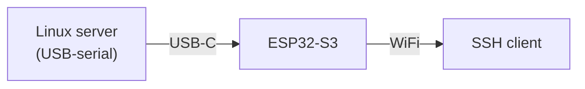
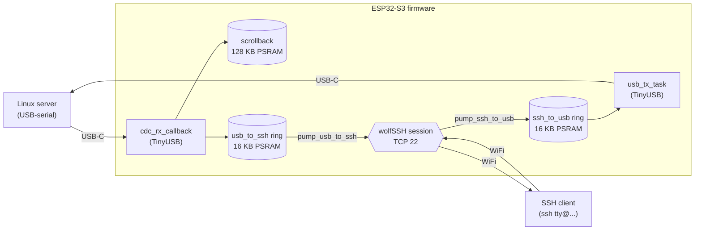

# esp-tty -- Nano Console Server

Wireless out-of-band serial console -- designed for a Linux server you
don't want to lose access to.

When the server's primary network goes down -- bad netplan, locked-out
firewall rule, NIC carrier loss, mis-pulled cable, switch failure on
the management VLAN -- you reach it via this device. Plug the
ESP32-S3 DevKit into any free USB port on the server. The server
sees a virtual serial port (the ESP32-S3's TinyUSB CDC ACM endpoint --
typically `/dev/ttyACM1`; see [Server-side setup](#server-side-setup))
and runs `agetty` on it just like a hardware serial console. SSH into the ESP32-S3 over WiFi: you're
at the server's login prompt over a network path that has nothing
to do with the server's main NIC.



Requirements on the server side: a running Linux/BSD/macOS kernel
with USB host support and `agetty` (or equivalent) bound to the
resulting `/dev/ttyACM*` node. A Linux server is the design target;
a Raspberry Pi or other single-board computer works the same way.

A single SSH session is active at a time; opening a second one
preempts the first within ~200 ms. Public-key authentication only.
The username `tty` selects an interactive console session; the
username `ota` accepts a signed-and-encrypted firmware update over
the same SSH channel. Any other username is rejected before any key
material is inspected.

## Features

- **Wireless serial bridge** -- TinyUSB CDC ACM <-> wolfSSH stream over
  WiFi (TCP 22 by default), two 16 KB PSRAM ring buffers in between.
- **128 KB scrollback** -- captures the target's serial output even when
  no SSH client is connected; the last 1000 lines are replayed on every
  new SSH session.
- **Public-key auth** -- up to 8 ED25519 keys for `tty@` sessions
  (`AUTHORIZED_PUBKEYS` array), one separate key for `ota@`.
- **Hardware-accelerated crypto** -- ESP32-S3 SHA and AES peripherals via
  the wolfSSL Espressif port; mbedTLS for OTA also HW-accelerated.
  AES-256-GCM is the only cipher offered.
- **ED25519 host key**, generated on first boot, stored in
  AES-XTS-256-encrypted NVS. Fingerprint printed at every boot.
- **Encrypted OTA** -- X25519 ephemeral key exchange + HKDF-SHA256 + AES-256-GCM,
  authenticated via SSH public key (`OTA_AUTHORIZED_PUBKEY`), A/B partition
  scheme, automatic rollback if the new image fails its 30-second self-test.
- **WPA2/WPA3-Personal** out of the box (Mode A); **WPA2/WPA3-Enterprise EAP-TLS**
  with embedded certs opt-in via a `#define` (Mode B); or **SCEP auto-enrollment**
  from a Microsoft NDES CA on first boot, with background cert renewal (Mode C).
  See [`main/certs/README.md`](main/certs/README.md).
- **Off-grid networking defaults** -- unlimited WiFi reconnect and a DHCP
  watchdog that re-kicks the DHCP client if no lease arrives. Survives an
  AP or DHCP server outage without intervention.
- **Single config file** -- `main/config.h` (gitignored) holds every
  per-deployment knob: credentials, keys, USB descriptors, MAC override,
  hostname, retry policy, buffer sizes.
- **240 MHz CPU, `-O2` build** -- production-tuned performance defaults.
- **236 native unit tests** across 20 suites, plus 37 pytest integration
  cases -- all run on the host without any ESP32 hardware or emulator.

## Hardware

Target: **Espressif ESP32-S3-DevKitC-1 N16R8** -- 16 MB QIO flash, 8 MB
OPI PSRAM. The PSRAM holds the ring buffers and scrollback; the flash
holds the A/B OTA partitions.

Other ESP32-S3 modules work with adjustments to `partitions.csv` (assumes
16 MB flash) and `boards/esp32-s3-devkitc-1-n16r8.json` (PSRAM type).
Boards without PSRAM need the ring sizes and scrollback capacity reduced
to fit internal SRAM.

## Quick start

```
git clone <repo-url> && cd esp-tty
python3 -m venv .venv && .venv/bin/pip install -r requirements.txt

cp main/config.h.example main/config.h
$EDITOR main/config.h     # Mode A (PSK): set WIFI_SSID, WIFI_PASS, AUTHORIZED_PUBKEYS,
                          # OTA_AUTHORIZED_PUBKEY at minimum.
                          # Mode C (SCEP): also set WIFI_ENTERPRISE_SSID, EAP_IDENTITY,
                          # SCEP_URL, SCEP_CHALLENGE_PASSWORD -- see config.h.example.

make            # build + flash (auto-detects the CH340 port)
```

Find the device IP and host-key fingerprint in the UART boot log
(`make monitor` or `pio device monitor`):

```
I (1099) wifi: DHCP hostname: esp-tty
I (1203) wifi: WiFi MAC: 1c:db:d4:74:a1:fc
I (5026) wifi: IP address : 192.168.1.42
I (5037) host_key: Host key SHA-256 fingerprint: 88:e0:a6:58:...
I (5079) ssh_server: Listening on TCP port 22
```

Connect to that IP:

```
ssh tty@192.168.1.42
```

If you'd rather reach the device by name, define `MDNS_ENABLE` in
`config.h` and `ssh tty@esp-tty.local` will work via Avahi (Linux),
Bonjour (macOS/Windows), or any other mDNS-aware resolver.

Verify the fingerprint matches what was printed on first boot. The
username is `tty` for a console session or `ota` for a signed
firmware upload.

### Server-side setup

**Which port is which.** The DevKitC exposes two USB interfaces on the
same cable:

| USB VID:PID | Device node | What it is |
|---|---|---|
| `1a86:55d3` | `ttyACM0` | CH340 USB-UART -- ESP-IDF boot log and flash port |
| `303a:4001` | `ttyACM1` | esp-tty TinyUSB CDC -- the SSH bridge data path |

Node numbers shift if other ACM devices are present; to find the bridge
port reliably, match by VID:PID:

```
ls -l /dev/serial/by-id/ | grep '303a'
```

Or add a udev rule that gives it a stable symlink:

```
# /etc/udev/rules.d/99-esp-tty.rules
SUBSYSTEM=="tty", ATTRS{idVendor}=="303a", ATTRS{idProduct}=="4001", SYMLINK+="ttyESPTTY"
```

Enable getty on the bridge port (whichever node it is):

```
systemctl enable --now serial-getty@ttyACM1.service
```

No drop-ins, no `TERM=` override, no special agetty flags needed.
SSHing into the device now lands you at the server's login prompt
over the bridge, with full TTY behaviour (echo, line editing,
job control, scrollback). This is the primary use case: a second
network path to your server's console, independent of its main NIC.

**Recommended for reliability** -- the stock unit has
`Restart=always` but systemd's default rate-limit
(`StartLimitBurst=5 / StartLimitIntervalSec=10`) makes it give up
after a handful of restarts in quick succession. Every time the
ESP32-S3 reboots (OTA, brief power glitch, USB hub hiccup), the CDC
node re-enumerates and getty restarts; on a flapping link that's
easy to exceed. Disable the rate-limit so getty restarts forever:

```
sudo mkdir -p /etc/systemd/system/serial-getty@ttyACM1.service.d
sudo tee /etc/systemd/system/serial-getty@ttyACM1.service.d/restart-limits.conf <<'EOF'
[Service]
RestartSec=2
StartLimitIntervalSec=0
EOF
sudo systemctl daemon-reload
sudo systemctl restart serial-getty@ttyACM1.service
```

With `StartLimitIntervalSec=0` and `RestartSec=2`, getty respawns
every 2 s indefinitely no matter how often the device re-enumerates.
This is the right setting for an unattended out-of-band console.

## Configuration

Every per-deployment knob lives in `main/config.h` (copied from
`main/config.h.example`, gitignored). The example file documents each
option with usage notes; the highlights:

| Section | Keys | Purpose |
|---|---|---|
| WiFi | `WIFI_SSID`, `WIFI_PASS`, optional `WIFI_USE_ENTERPRISE` | network credentials |
| SSH | `SSH_PORT`, `AUTHORIZED_PUBKEYS`, `OTA_AUTHORIZED_PUBKEY` | port + auth |
| USB | `USB_VID`, `USB_PID`, `USB_MANUFACTURER_STRING`, `USB_PRODUCT_STRING`, `USB_SERIAL_STRING`, `USB_CDC_STRING`, `USB_DEVICE_VERSION` | descriptors shown by `lsusb` |
| Network identity | `DEVICE_HOSTNAME`, optional `WIFI_MAC_BYTES` | DHCP hostname, MAC override |
| IPv4 addressing | `USE_STATIC_IPV4` (define to enable), `STATIC_IPV4_ADDRESS`, `STATIC_IPV4_NETMASK`, `STATIC_IPV4_GATEWAY`, optional `STATIC_IPV4_DNS_PRIMARY` / `STATIC_IPV4_DNS_SECONDARY` | default DHCPv4; define `USE_STATIC_IPV4` for a fixed address |
| IPv6 addressing | `IPV6_MODE` -- one of `IPV6_MODE_DISABLED`, `IPV6_MODE_SLAAC` (default), `IPV6_MODE_SLAAC_STATELESS_DHCPV6`, `IPV6_MODE_STATEFUL_DHCPV6`, `IPV6_MODE_STATIC`; static mode also needs `STATIC_IPV6_ADDRESS`, `STATIC_IPV6_PREFIX_LEN`, `STATIC_IPV6_GATEWAY`, optional DNS | IPv6 addressing mode |
| Tuning | `WIFI_MAX_RETRY` (0 = infinite), `DHCP_RETRY_TIMEOUT_SEC`, `TCP_KEEPALIVE_*`, `SSH_HANDSHAKE_TIMEOUT_SEC`, `OTA_ROLLBACK_DELAY_MS` | timeouts and retry policy |
| Buffers | `RING_BUFFER_BYTES`, `SCROLLBACK_BUFFER_BYTES`, `SCROLLBACK_REPLAY_LINES`, `MAX_TTY_KEYS` | memory sizing |

All knobs guard with `#ifndef`, so omitting any of them keeps a sensible
production default.

### Managing multiple devices

If you run more than one ESP32, keep a separate config per device as
`main/config.h.<devname>` (e.g. `main/config.h.alpha`,
`main/config.h.beta`). Each file starts with a marker line that tells
the Makefile where to ship its OTA build:

```c
// MAKE-OTA-IP: 10.57.99.42
// ...rest of the per-device config follows...
```

Then build and ship per device by name:

```
make ota   alpha    # copies config.h.alpha -> config.h, builds, OTAs to the marker IP
make flash alpha    # same config switch, but USB-flashes (marker is ignored)
```

`make flash` and `make build` with no argument fall back to the current
`main/config.h` unchanged, so the single-device workflow keeps working.
`make ota` also accepts a raw IP or hostname -- if the argument doesn't
match a `main/config.h.<name>` file, the current `config.h` is built and
uploaded as-is:

```
make ota 192.168.1.42
make ota esp-tty.local
```

`main/config.h` itself is gitignored and treated as the "currently
materialized" copy; the canonical per-device files
(`config.h.<devname>`) are what you maintain. Add `main/config.h.*` to
`.gitignore` if those contain WiFi credentials or other secrets you
don't want in the repo.

## OTA updates

Build, sign, encrypt, and stream a firmware update to a running device
in one step:

```
make ota 192.168.1.42       # raw IP or hostname
make ota esp-tty.local
make ota alpha              # per-device config (see above)
```

`make ota` builds the current `main/config.h` (or the
`config.h.<devname>` you named) and runs `scripts/ota_send.py
<host> .pio/build/esp32s3/firmware.bin`. The script opens an SSH
connection to `ota@<host>` (your normal SSH agent / `~/.ssh/config`
resolves the key) and then performs an ephemeral X25519 key exchange
inside the SSH session, derives a per-upload AES-256-GCM key with
HKDF-SHA256, and streams the encrypted firmware to the device.

If you'd rather run it by hand:

```
.venv/bin/python scripts/ota_send.py <device-ip> .pio/build/esp32s3/firmware.bin
```

The device:
1. Generates an ephemeral X25519 keypair and sends its public half over
   the SSH channel.
2. Receives the client's ephemeral X25519 public key, derives the
   shared secret, and HKDF-SHA256s it into a 32-byte AES-256-GCM key.
3. Reads the encrypted firmware into PSRAM, AES-256-GCM-decrypts it,
   and verifies the authentication tag.
4. Writes the plaintext to the inactive OTA partition.
5. Sets the new partition as the next boot target and reboots.
6. The new firmware self-marks valid after 30 s; if it crashes or
   wedges before then, the bootloader rolls back automatically.

A failed auth-tag check aborts the upload; the boot partition is not
modified. Because the encryption key is derived per-session and is
never written to disk, **no pre-shared OTA key material is needed on
the build host** -- the only OTA credential is the SSH key matching
`OTA_AUTHORIZED_PUBKEY`.

## Automatic certificate enrollment (SCEP)

Implements RFC 8894 SCEP to enroll a device certificate from a Microsoft NDES
CA without manually copying key material per device. The enrolled cert is used
for WPA3-Enterprise EAP-TLS authentication, removing the need for PSK
credentials in production firmware.

### Threat-model fit

WPA3-Enterprise EAP-TLS with per-device certificates offers stronger
authentication guarantees than PSK: each device holds a unique RSA-2048
private key, never transmitted over any network, and the CA can revoke
individual device certs if a device is compromised. SCEP automates the
enrollment so new devices self-provision on first boot.

### Two SSIDs, by design

802.11 ties an SSID to one auth mode, so this feature uses two distinct
networks:

| Knob | Network | Auth | Used for |
|---|---|---|---|
| `WIFI_SSID` + `WIFI_PASS` | bootstrap | WPA2/WPA3-Personal (PSK) | NTP sync + SCEP enrollment only |
| `WIFI_ENTERPRISE_SSID` + `EAP_IDENTITY` | enterprise | WPA3-Enterprise / EAP-TLS | normal operation |

They are typically separate VLANs on the same physical AP. The PSK
bootstrap network does not need internet access -- only TCP/443 to the
SCEP server and UDP/123 to your NTP source.

### Boot decision

The ESP32-S3 has no battery-backed RTC. On a cold boot `time(NULL)` returns
0, making cert expiry comparisons meaningless until NTP runs. Per-boot, the
state machine (`lib/wifi_state/wifi_state.c`) picks one of three paths:

| Path | Condition | Action |
|---|---|---|
| **ENTERPRISE** | Cert in NVS; clock synced + valid, or unsynced | Join `WIFI_ENTERPRISE_SSID` via EAP-TLS |
| **BOOTSTRAP_NTP_ONLY** | Cert in NVS; `OTA_NTP_BEFORE_EAPTLS=1`; clock not synced | Join `WIFI_SSID` (PSK) for SNTP only, then retry ENTERPRISE |
| **BOOTSTRAP_FULL** | No cert, cert known-expired, or too many EAP-TLS failures | Join `WIFI_SSID` (PSK), sync NTP, run SCEP, store cert, reboot |

A full SCEP enrollment against real NDES takes ~9 s (mostly RSA-2048 keygen
+ the RA round-trip).

**No-NTP mode (`SCEP_NO_NTP_USE_ISSUANCE_TIME`)**: for air-gapped deployments
with no NTP source. Every boot re-enrolls a fresh cert and uses its X.509
NotBefore as the local-clock anchor. Trades ~9 s per boot and one NDES
challenge password per reboot for a clock anchor without an NTP server.
`cert_renewer` is disabled -- each reboot is the renewal. Mutually exclusive
with `OTA_NTP_BEFORE_EAPTLS`.

### Configuration knobs

All in `main/config.h`:

| Key | Purpose |
|---|---|
| `SCEP_URL` | Full URL to the NDES `mscep.dll` PKIOperation endpoint, e.g. `https://pki.example.com/certsrv/mscep/mscep.dll` |
| `SCEP_CHALLENGE_PASSWORD` | One-time enrollment password from the NDES web UI |
| `WIFI_ENTERPRISE_SSID` | SSID of the WPA3-Enterprise network; also the trigger that enables the full SCEP+EAP-TLS state machine |
| `OTA_NTP_BEFORE_EAPTLS` | Set to `1` to require an NTP sync before attempting EAP-TLS (recommended for production) |
| `EAPTLS_FALLBACK_TIMEOUT_SEC` | Seconds to wait for EAP-TLS association before falling back to bootstrap PSK |
| `WIFI_ENTERPRISE_RETRY_MAX` | Consecutive EAP-TLS failures before forcing a re-enroll (0 = unlimited retries) |
| `CERT_RENEWAL_WINDOW_DAYS` | Start renewing when fewer than this many days remain before cert expiry (default 7) |

Place your NDES CA chain PEM in `main/certs/scep_ca.pem`. This file is used
as the TLS trust anchor for the HTTPS connection to NDES; it must contain the
root CA that signed the NDES server's TLS certificate (not necessarily the
same CA that signs device certs).

### Compatibility and limitations

- Tested against **Microsoft NDES (legacy CryptoAPI/CSP mode)** on Windows
  Server. NDES in this mode rejects ECDSA-signed pkiMessages; the firmware
  always uses **RSA-2048** for the device key and CSR signature.
- The NDES CertRep uses **RSAES-OAEP/SHA-1** to encrypt the CEK back to the
  client; the firmware dispatches on the `keyEncryptionAlgorithm` OID so it
  also accepts the legacy **PKCS#1 v1.5** variant used by some other SCEP CAs.
- **RSA-2048 only** -- NDES in legacy mode will not issue certs for EC keys.
- **One-time bootstrap network required** -- a PSK SSID must be reachable on
  first boot and on every re-enrollment. After successful enrollment the device
  operates entirely on the enterprise network.

See the OTA section above for the related auto-update story; the same EAP-TLS
cert can be used to authenticate OTA connections in a combined deployment.

## Security model

Authentication is public-key only. The authorized keys are baked into
the firmware from `config.h` at build time; updating them is a firmware
re-flash.

The threat model is a network attacker. A physical attacker who can
dump the SPI flash extracts the NVS key from the `nvs_keys` partition
and decrypts the on-device NVS (which holds the ED25519 host key).
The authorized public keys live in firmware flash (unencrypted but
useless on their own). OTA authentication requires the ED25519 private
key matching `OTA_AUTHORIZED_PUBKEY`, which is held off-device by the
operator; the ephemeral X25519 key exchange inside the OTA session adds
an independent encryption layer with no pre-shared key material baked
into the firmware.

Cipher hardening (compile-time):
- AES-CBC, AES-192, SHA-1 MAC, DH key exchange are all disabled in
  `components/wolfssl/include/user_settings.h`.
- The runtime cipher list is additionally pinned to
  `aes256-gcm@openssh.com` only via `wolfSSH_CTX_SetAlgoListCipher`.

No eFuses are burned. SPI flash encryption (which would close the
physical-extraction gap) is permanent and would block reflashing; it's
intentionally out of scope.

## Architecture



The single FreeRTOS `ssh_server_task` runs the accept loop. On each
connection it authenticates the user and, for `tty@`, spawns two pump
tasks that move bytes between the wolfSSH stream and the rings. The
TinyUSB callback (RX) and `usb_tx_task` (TX) are persistent and reuse
the same rings across sessions.

## Project layout

| Path | What's there |
|---|---|
| [`main/`](main/README.md) | Firmware entry point and ESP-IDF-dependent code |
| [`main/certs/`](main/certs/README.md) | EAP-TLS client certificates (gitignored except `.example`) |
| [`lib/`](lib/README.md) | Platform-agnostic libraries -- also compile on native host for tests |
| [`components/`](components/README.md) | Local ESP-IDF components (currently just the wolfSSL bridge) |
| [`boards/`](boards/README.md) | Project-local PlatformIO board manifests |
| [`patches/`](patches/README.md) | Patches applied to `managed_components/` at cmake configure time |
| [`scripts/`](scripts/README.md) | Build hooks, key generation, firmware signing, port detection |
| [`test/`](test/README.md) | Native unit tests, QEMU smoke tests, simulator config |
| `partitions.csv` | 16 MB A/B OTA partition table |
| `platformio.ini` | Build environment definitions |
| `sdkconfig.defaults` | Base ESP-IDF sdkconfig overrides |
| `Makefile` | `make build` / `make flash` wrappers around PlatformIO |
| `requirements.txt` | Python dependencies (platformio + cryptography) |

Each subfolder has its own README with details on the files it
contains.

## Build environments

Three PlatformIO environments are defined in `platformio.ini`:

| Env | Purpose | Build flag |
|---|---|---|
| `esp32s3` | real ESP32-S3 hardware | -- |
| `wokwi` | Wokwi simulator + QEMU smoke tests | `-DBRIDGE_LOOPBACK=1` (rings wired back-to-back, TinyUSB bypassed) |
| `native` | host unit tests | `-DRING_NATIVE=1 -DUNIT_TEST` |

```
make build              # esp32s3
pio run -e wokwi        # Wokwi build (no flash)
pio test -e native      # 236 native test cases
```

## Tests

Three tiers, all run on a Linux/macOS host without ESP32-S3 hardware:

| Tier | Cases / scripts | Command |
|---|---|---|
| Native Unity unit tests | 236 cases across 20 suites | `pio test -e native` |
| pytest integration scripts | 37 cases (OTA protocol, OTA send unit, SCEP protocol) | `pytest test/scripts/test_ota_*.py test/scripts/test_scep_*.py` |
| QEMU / shell scripts | QEMU boot, NVS persistence, clean build, patch application | `bash` / `python3` per script in `test/scripts/` |
| Wokwi simulator | interactive | open `test/wokwi/wokwi.toml` |

The native suite covers every library in `lib/` end-to-end, including
the helpers extracted from `main/` (CDC drain, terminal-resize CSI
formatter, scrollback header formatter). See [`test/README.md`](test/README.md)
for the per-suite breakdown and the coverage map.

## Dependencies

```
python3 -m venv .venv
.venv/bin/pip install -r requirements.txt
```

That installs PlatformIO (the build orchestrator), `paramiko`, and
`cryptography` (both used by `scripts/ota_send.py`). PlatformIO pulls in ESP-IDF 5.4.1
LTS via `espressif32@6.11.0` and the rest of the toolchain on first
run. wolfSSL 5.8.2 and wolfSSH 1.4.20 are fetched by the IDF component
manager at cmake configure time.

System dependencies (not pip-installable):

| Tool | Used by |
|---|---|
| `openssl` | EAP-TLS cert generation |
| `qemu-system-xtensa` (Espressif fork) | QEMU smoke tests |
| `patch` | applying `patches/*.patch` at cmake configure |

## Scope

- **One SSH session at a time.** The target's serial console is a
  single shared resource. A new connection preempts the active one;
  there's no multiplexing layer.
- **mDNS / Bonjour (opt-in).** Off by default.  Define `MDNS_ENABLE`
  in `config.h` to have the device announce itself as
  `<DEVICE_HOSTNAME>.local` via multicast DNS (RFC 6762) and advertise
  the SSH service as `_ssh._tcp`.  Works with Avahi (Linux), Bonjour
  (macOS/Windows), and any mDNS-aware resolver.
- **Serial-data bridge only.** GPIO control of the target's reset or
  boot pins is out of scope.
- **eFuses are left unprogrammed by design** so the device stays
  reflashable. The implications for physical-attacker resistance are
  spelled out under "Security model".

## License

[GNU Affero General Public License v3.0](LICENSE) (AGPL-3.0).

If you run a modified version of this firmware on a device that
interacts with users over a network -- e.g. an SSH server reachable
beyond your own machines -- the AGPL requires you to make the
corresponding source available to those users. The full license text
is in [`LICENSE`](LICENSE).

Bundled components ship under their own licenses: wolfSSL/wolfSSH
(GPL-2.0-or-later or commercial), mbedTLS (Apache-2.0), TinyUSB (MIT),
ESP-IDF (Apache-2.0).
