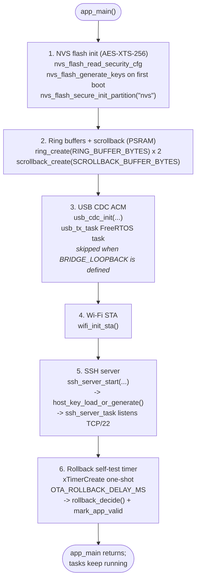

# main/ -- Firmware Entry Point and ESP32-S3-Specific Code

This directory is the ESP-IDF application component and the top-level firmware
entry point. PlatformIO treats it as the `src_dir` (see `platformio.ini`). All
source files here link against wolfSSH, TinyUSB, and ESP-IDF, and they depend on
FreeRTOS, the ESP32-S3 hardware peripherals, and NVS flash. None of them can be
compiled or unit-tested natively. Logic that does not require ESP-IDF has been
extracted to `lib/`, where it is covered by the native test suite under
`test/native/`.

`app_main` (in `main.c`) is the single firmware entry point. It initialises NVS
encryption, allocates the PSRAM-backed ring buffers and scrollback buffer, and
starts the USB CDC, Wi-Fi, and SSH server subsystems in order. It does not run
its own loop; all blocking work runs in FreeRTOS tasks spawned by the subsystems
it initialises. After starting the SSH server, `app_main` arms a one-shot
FreeRTOS timer (default 30 seconds). When the timer fires, `rollback_timer_cb`
calls `rollback_decide` and, if the running image is still in
`ESP_OTA_IMG_PENDING_VERIFY` state, calls `esp_ota_mark_app_valid_cancel_rollback`
to confirm the image and cancel any pending bootloader rollback. If the timer
cannot be created due to memory exhaustion, the mark-valid call is made
immediately as a fail-safe.

The SSH server (`ssh_server.c`) listens on `SSH_PORT` (default 22) and handles
all authentication and session management. Compile-time cipher hardening is
applied via `wolfssh_options.h`: AES-CBC, AES-192, SHA-1 MACs, and DH key
exchange are all disabled. The host key is an Ed25519 keypair generated once on
first boot and persisted in encrypted NVS; it is loaded or generated at server
start by `host_key.c`. When a second SSH client connects while a session is
active, the old session is torn down via a semaphore-coordinated shutdown of the
bridge pump tasks before `wolfSSH_free` is called, eliminating the use-after-free
race documented in commit `d2edfbe`. Authentication is public-key only; the OTA
username routes to `ota_session_run` instead of the bridge pump.

The USB CDC driver (`usb_cdc.c`) registers a TinyUSB CDC ACM device on the
ESP32-S3 native USB port. A `usb_tx_task` FreeRTOS task drains the `ssh_to_usb`
ring into `tud_cdc_write`; the TinyUSB `tud_cdc_rx_cb` callback pushes received
bytes non-blocking into `usb_to_ssh`. When `BRIDGE_LOOPBACK` is defined (Wokwi
and QEMU builds), `usb_cdc.c` is not compiled and the two rings are wired
directly together by the bridge pump, enabling loopback testing without USB
hardware.

`config.h` is the compile-time configuration file and is gitignored. It must be
created before the first build by copying `config.example.h` and filling in the
values specific to your deployment. The example file is extensively commented and
covers Wi-Fi credentials, SSH public keys, USB descriptor strings, network
identity, and operational tuning knobs such as ring buffer sizes, scrollback
capacity, TCP keepalive parameters, and the OTA rollback delay. Enterprise Wi-Fi
(WPA2/WPA3 EAP-TLS) is an opt-in compile-time feature enabled by defining
`WIFI_USE_ENTERPRISE` in `config.h`; the required PEM certificates belong in
`main/certs/` (see `main/certs/README.md` for setup instructions and the
`EMBED_TXTFILES` mechanism that assembles them into the firmware binary).

## Source files

| File | Role |
|---|---|
| `main.c` | `app_main`: NVS AES-XTS-256 init, ring + scrollback allocation in PSRAM, subsystem start sequence, OTA rollback timer |
| `wifi.c` | Wi-Fi STA setup (WPA2/WPA3-Personal or EAP-TLS), event-driven reconnect, DHCP watchdog timer, static IPv4, IPv6 SLAAC/DHCPv6/static, optional MAC address override |
| `usb_cdc.c` | TinyUSB CDC ACM driver, custom USB device descriptors, `usb_tx_task`, RX callback into ring |
| `ssh_server.c` | wolfSSH accept loop, single-session takeover with semaphore synchronisation, pubkey auth dispatch, bridge pump tasks |
| `ota_session.c` | OTA SSH channel handler: streaming receive, `ota_verify_feed` loop, ECDSA+AES-GCM verification, partition switch and reboot |
| `host_key.c` | ED25519 host key generation (wolfCrypt RNG) and NVS persistence; SHA-256 fingerprint printed to UART on every boot |
| `config.example.h` | Compile-time configuration template; copy to `config.h` (gitignored) before building |
| `wolfssh_options.h` | wolfSSH compile-time feature flags: disables AES-CBC, AES-192, SHA-1 MACs, and DH key exchange |
| `CMakeLists.txt` | ESP-IDF component registration; conditionally embeds EAP-TLS certs via `EMBED_TXTFILES` when present in `certs/` |
| `idf_component.yml` | IDF component manager manifest (wolfSSL, wolfSSH, TinyUSB versions) |

## Boot sequence



## Configuration

Before building, copy `config.example.h` to `config.h` and edit it:

```
cp main/config.example.h main/config.h
```

`config.h` is gitignored and must never be committed. Key knobs:

| Macro | Purpose |
|---|---|
| `WIFI_SSID` / `WIFI_PASS` | WPA2/WPA3-Personal credentials |
| `WIFI_USE_ENTERPRISE` | Define to switch to EAP-TLS (see `certs/`) |
| `EAP_IDENTITY` | Outer identity for EAP-TLS Phase 1 |
| `EAP_DISABLE_TIME_CHECK` | Bypass cert-expiry check if SNTP is not yet synced |
| `AUTHORIZED_PUBKEYS` | Comma-separated ED25519 public keys for `tty` sessions (up to `MAX_TTY_KEYS`) |
| `OTA_AUTHORIZED_PUBKEY` | Single ED25519 public key for `ota` sessions |
| `SSH_PORT` | TCP port for the SSH server (default 22) |
| `USB_VID` / `USB_PID` | TinyUSB device descriptor VID and PID |
| `USB_MANUFACTURER_STRING` / `USB_PRODUCT_STRING` | USB string descriptors |
| `DEVICE_HOSTNAME` | DHCP hostname (shows in router lease table) |
| `WIFI_MAC_BYTES` | Optional locally-administered MAC override |
| `USE_STATIC_IPV4` | Define to use a fixed IPv4 address instead of DHCP |
| `STATIC_IPV4_ADDRESS` / `STATIC_IPV4_NETMASK` / `STATIC_IPV4_GATEWAY` | Required when `USE_STATIC_IPV4` is defined |
| `STATIC_IPV4_DNS_PRIMARY` / `STATIC_IPV4_DNS_SECONDARY` | Optional static DNS servers (IPv4) |
| `IPV6_MODE` | IPv6 mode: `IPV6_MODE_DISABLED`, `IPV6_MODE_SLAAC` (default), `IPV6_MODE_SLAAC_STATELESS_DHCPV6`, `IPV6_MODE_STATEFUL_DHCPV6`, `IPV6_MODE_STATIC` |
| `STATIC_IPV6_ADDRESS` / `STATIC_IPV6_PREFIX_LEN` / `STATIC_IPV6_GATEWAY` | Required when `IPV6_MODE` is `IPV6_MODE_STATIC` |
| `STATIC_IPV6_DNS_PRIMARY` / `STATIC_IPV6_DNS_SECONDARY` | Optional static DNS servers (IPv6) |
| `WIFI_MAX_RETRY` | Reconnect attempt limit (0 = unlimited) |
| `DHCP_RETRY_TIMEOUT_SEC` | DHCP watchdog timeout in seconds (disabled automatically when `USE_STATIC_IPV4` is defined) |
| `SSH_HANDSHAKE_TIMEOUT_SEC` | Drop clients that do not complete auth within this window |
| `TCP_KEEPALIVE_IDLE_SEC` / `TCP_KEEPALIVE_INTVL_SEC` / `TCP_KEEPALIVE_COUNT` | TCP keepalive parameters |
| `OTA_ROLLBACK_DELAY_MS` | Milliseconds after boot before the new image is marked valid |
| `RING_BUFFER_BYTES` | Per-direction ring buffer size (default 16 KB, PSRAM) |
| `SCROLLBACK_BUFFER_BYTES` | Scrollback history capacity (default 128 KB, PSRAM) |
| `SCROLLBACK_REPLAY_LINES` | Lines of scrollback replayed to a newly connected SSH client |

## EAP-TLS certificates

When `WIFI_USE_ENTERPRISE` is defined, three PEM files must be placed in
`main/certs/` before building. The real files are gitignored; placeholder
`.example` stubs are tracked in git. See `main/certs/README.md` for the full
setup procedure, including how `CMakeLists.txt` detects the files at configure
time and embeds them via `EMBED_TXTFILES`.

## Relationship to lib/

The subsystems in this directory depend on helper libraries in `lib/` that
contain no ESP-IDF dependencies and are covered by native unit tests:

| lib/ module | Used by |
|---|---|
| `ring` | `main.c`, `usb_cdc.c`, `ssh_server.c` |
| `scrollback` | `main.c`, `ssh_server.c` |
| `pubkey_auth` | `ssh_server.c` (auth check + user classification) |
| `ota_verify` / `ota_stream` | `ota_session.c` |
| `rollback_decision` | `main.c` (rollback timer callback) |
| `bridge` / `usb_cdc_drain` / `term_resize` | `ssh_server.c` bridge pump |
