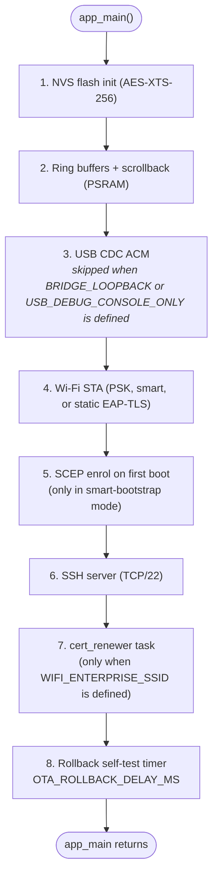

# main/ -- Firmware Entry Point and ESP32-S3-Specific Code

This directory is the ESP-IDF application component and the top-level
firmware entry point. PlatformIO treats it as the `src_dir` (see
`platformio.ini`). Every source file here links against wolfSSH, TinyUSB, or
ESP-IDF and depends on FreeRTOS, the ESP32-S3 hardware peripherals, NVS, or
mbedTLS. None of them compile or run natively; platform-agnostic logic is
extracted into `lib/` where it is covered by the host test suite.

`app_main` (in `main.c`) is the single firmware entry point. It initialises
NVS encryption, allocates the PSRAM-backed ring buffers and scrollback
buffer, brings up Wi-Fi (PSK or SCEP-driven WPA3-Enterprise) and the USB
CDC interface, starts the SSH server, and arms a one-shot rollback timer.
After the timer fires it calls `rollback_decide` and, if the running image
is still `ESP_OTA_IMG_PENDING_VERIFY`, calls
`esp_ota_mark_app_valid_cancel_rollback`. Once `app_main` returns the
spawned FreeRTOS tasks keep running.

## Source files

| File | Role |
|---|---|
| `main.c` | `app_main`: NVS AES-XTS-256 init, ring + scrollback allocation in PSRAM, subsystem start sequence, OTA rollback timer |
| `wifi.c` / `wifi.h` | Wi-Fi STA driver: PSK / smart bootstrap (PSK -> NTP -> SCEP -> EAP-TLS) / static-EAP-TLS modes, event-driven reconnect, DHCP watchdog, IPv4/IPv6 config, optional MAC override |
| `usb_cdc.c` / `usb_cdc.h` | TinyUSB CDC ACM driver, custom USB descriptors, `usb_tx_task`, RX callback into ring (no-op stubs when `BRIDGE_LOOPBACK` or `USB_DEBUG_CONSOLE_ONLY` is defined) |
| `ssh_server.c` / `ssh_server.h` | wolfSSH accept loop, single-session takeover via semaphore, pubkey auth, bridge pump tasks, terminal-resize callback |
| `ota_session.c` / `ota_session.h` | `ota@` SSH channel handler: ephemeral X25519 / HKDF / AES-256-GCM via wolfCrypt, streaming decrypt into the inactive OTA partition, partition switch + reboot |
| `host_key.c` / `host_key.h` | Ed25519 host-key generation (wolfCrypt RNG) and NVS persistence; SHA-256 fingerprint printed at every boot |
| `scep_enroll.c` / `scep_enroll.h` | One-shot SCEP enrolment orchestrator: `GetCACert` -> keygen -> CSR + self-signed signer -> PKCSReq -> CertRep parse -> `cred_store_save` |
| `cert_renewer.c` / `cert_renewer.h` | Background FreeRTOS task that polls the stored cert's `NotAfter` and re-enrols via SCEP when inside `CERT_RENEWAL_WINDOW_DAYS`, then pushes the new credentials into the EAP supplicant |
| `wolfssh_options.h` | wolfSSH compile-time feature flags: disables AES-CBC, AES-192, SHA-1 MACs, and DH key exchange |
| `config.example.h` | Compile-time configuration template; copy to `config.h` (gitignored) before building |
| `config.h` | Active per-build configuration (gitignored) |
| `config.<dev>.h` | Per-device overlays selected by `make flash DEV=<dev>` / `make ota <dev>` |
| `idf_component.yml` | IDF Component Manager manifest (wolfSSL, wolfSSH, TinyUSB, mDNS versions) |
| `CMakeLists.txt` | Registers the IDF component; pulls in selected `lib/` sources and conditionally embeds `certs/ca.pem`, `client.crt`, `client.key`, `scep_ca.pem` via `EMBED_TXTFILES` |

The component also compiles selected `lib/` sources directly via
`CMakeLists.txt` (`ring`, `bridge`, `usb_cdc_drain`, `term_resize`,
`pubkey_auth`, `mdns_dispatch`, `ssh_keepalive`, `cert_renewer_decide`,
`scep_proto`, `cred_store`, `scep_transport`).

## Boot sequence



## Configuration

Before building, copy `config.example.h` to `config.h` and edit it:

```
cp main/config.example.h main/config.h
```

`config.h` is gitignored and must never be committed. `config.example.h` is
extensively commented and describes the three Wi-Fi modes (A = PSK,
B = static EAP-TLS, C = smart-bootstrap PSK->SCEP->EAP-TLS), all timing
macros, and the per-device override mechanism. Key knobs:

| Macro | Purpose |
|---|---|
| `WIFI_SSID` / `WIFI_PASS` | WPA2/WPA3-Personal credentials (Mode A bootstrap) |
| `WIFI_USE_ENTERPRISE` | Define to switch to static EAP-TLS (Mode B) using `certs/ca.pem` + `client.crt` + `client.key` |
| `WIFI_ENTERPRISE_SSID` | Define to enable Mode C smart bootstrap (PSK + SCEP -> WPA3-Enterprise) |
| `EAP_IDENTITY` | Outer identity for EAP-TLS Phase 1 |
| `EAP_DISABLE_TIME_CHECK` | Bypass cert-expiry check if SNTP is not yet synced |
| `NTP_ENABLE` / `NTP_SERVER_LIST` / `NTP_TIMEZONE_POSIX` | SNTP client config |
| `NTP_BEFORE_EAPTLS` | In Mode C, sync NTP before attempting the EAP-TLS join (cert validity check) |
| `BOOTSTRAP_NTP_SYNC_TIMEOUT_SEC` | Max seconds to wait for SNTP during bootstrap |
| `EAPTLS_HANDSHAKE_TIMEOUT_SEC` | Drop the EAP attempt if no `WIFI_EVENT_STA_CONNECTED` within this window |
| `SCEP_URL` / `SCEP_CHALLENGE_PASSWORD` / `SCEP_SUBJECT_O` etc. | SCEP server endpoint and CSR fields |
| `SCEP_NO_NTP_USE_ISSUANCE_TIME` | Use the issued cert's `NotBefore` as the time source when NTP is unavailable |
| `CERT_RENEWAL_WINDOW_DAYS` | Re-enrol when the stored cert expires within this many days |
| `CERT_REENROLL_THRESHOLD_SEC` | Minimum age before a renewal attempt is allowed (rate-limit) |
| `AUTHORIZED_PUBKEYS` / `OTA_AUTHORIZED_PUBKEY` | Ed25519 keys for `tty` and `ota` SSH sessions |
| `SSH_PORT` | TCP port for the SSH server (default 22) |
| `USB_VID` / `USB_PID` / `USB_MANUFACTURER_STRING` / `USB_PRODUCT_STRING` | TinyUSB device descriptors |
| `DEVICE_HOSTNAME` | DHCP hostname |
| `WIFI_MAC_BYTES` | Optional locally-administered MAC override |
| `USE_STATIC_IPV4` / `STATIC_IPV4_*` | Optional fixed IPv4 config |
| `IPV6_MODE` / `STATIC_IPV6_*` | IPv6 mode and optional static address |
| `WIFI_MAX_RETRY` / `DHCP_RETRY_TIMEOUT_SEC` | Reconnect / DHCP watchdog tuning |
| `SSH_HANDSHAKE_TIMEOUT_SEC` | Drop SSH clients that do not complete auth in time |
| `TCP_KEEPALIVE_IDLE_SEC` / `TCP_KEEPALIVE_INTVL_SEC` / `TCP_KEEPALIVE_COUNT` | TCP keepalive |
| `OTA_ROLLBACK_DELAY_MS` | Milliseconds after boot before the new image is marked valid |
| `RING_BUFFER_BYTES` / `SCROLLBACK_BUFFER_BYTES` / `SCROLLBACK_REPLAY_LINES` | PSRAM-backed buffer sizing |

## Embedded PEM material

`main/certs/` holds the trust material that `main/CMakeLists.txt` embeds via
`EMBED_TXTFILES`. See [`main/certs/README.md`](certs/README.md) for the file
layout (Mode B EAP-TLS triple + Mode C `scep_ca.pem` trust anchor), how the
files reach the firmware, and how to generate test material.

## Relationship to lib/

The subsystems in this directory rely on platform-agnostic helpers from
`lib/` that carry their own native test suites:

| lib/ module | Used by |
|---|---|
| `ring` | `main.c`, `usb_cdc.c`, `ssh_server.c` |
| `scrollback` | `main.c`, `ssh_server.c` |
| `pubkey_auth` | `ssh_server.c` |
| `bridge` / `usb_cdc_drain` / `term_resize` | `ssh_server.c` bridge pump |
| `rollback_decision` | `main.c` rollback timer |
| `mdns_dispatch` | `main.c` |
| `ssh_keepalive` | `ssh_server.c` |
| `scep_proto` / `scep_transport` / `cred_store` | `scep_enroll.c`, `cert_renewer.c` |
| `cert_renewer` (decide) | `cert_renewer.c` |
| `wifi_state` | `wifi.c` (Mode C state machine) |
